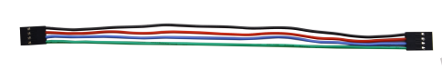
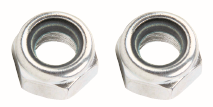
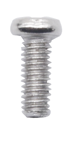
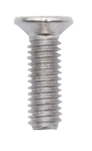
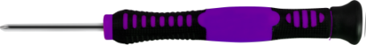

# KS4027 KS4028 Smart Home Kit for Micro:bit Python Tutorial

## 1.Introduction：

Fueled by the rapid development of technology, smart homes automatically controlled remotely by smart phones and other devices have become more common. For the same reason, they have increasingly gained closer attention and caught
people ‘s fancy.

Bearing the aim to make improvements in household living conditions, the smart home system has been integrated with technologies including computer science, telecommunication, automatic control and others and emerged as a comprehensive
and smart system featuring safety, convenience, coziness, services , utility and environmental consciousness.

## 2.Description：

Launched by Keyestudio, this smart home kit is based on the open-source hardware of Micro:bit and designed for those who dream of living a more comfortable life with the help of technologies.

This smart home system, with Micro:bit as its control board, is equipped with a 1602 LCD, a DHT11 temperature and humidity sensor, an analog gas sensor(MQ_2), a PIR motion sensor , a 6812 RGB module, a servo, a steam sensor, a Micro:bit BT and other sensors.

With the help of these sensors, this kit can be applied to detect temperature, humidity and the concentration of flammable gases in your home and open and close doors. Furthermore, all the information detected can display on 1602 LCD in real time available for you to check and monitor via smart phones or iPad. By the way, it supports powering by solar energy or via USB cable.

This tutorial programs in MicroPython language which is the Micro:bit version of Python language. It will guide you to use software Mu to write MicroPython language for Micro:bit main board to control the smart home system. In this process, not only can you enhance your ability to make stuffs but also learn the skills of programming.

Python is one of the most popular programming language especially in machine learning for its availability and accessibility have brought huge convenience to this field. However, MicroPython is a lean and efficient implementation of the Python programming language for microcontrollers and embedded systems.

This tutorial is a Python tutorial for micro:bit smart home. If you haven't learned the basic tutorial ( Makecode version of Tutorial), we strongly recommend you to learn it first. Because the basic one is programmed using graphical blocks, which is easier to understand and start.

## 3.Kit List：

When you get this delicate kit, please confirm whether all components listed below have been delivered.

| \#   | Parts                                                               | Quantity | Picture                                                                                                                                                             |
|------|---------------------------------------------------------------------|----------|---------------------------------------------------------------------------------------------------------------------------------------------------------------------|
|  1   | Micro:bit Main Board Included in KS4027 Not included in KS4028      | 1        |                                                                                                                  |
|  2   | Keyestudio Micro:bit Expansion Board with IO Port                   | 1        |                                                                                                               |
|  3   |  Wooden Board                                                       | 7        |                                                                                                         |
|  4   |  Acrylic Board                                                      | 3        |                   |
|  5   |  6812 RGB Module                                                    | 1        |                                                                                                                    |
| 6    | Analog Gas Sensor                                                   | 1        |                                                                                                                    |
|  7   |  130 Motor Module                                                   |  1       |                                                                                                                 |
|  8   |  Steam Sensor                                                       | 1        |                                                                                                                    |
|  9   | DHT11 Temperature and Humidity Sensor                               | 1        |                                                                                                                     |
|  10  |  PIR Motion Sensor                                                  | 1        |                                                                                                                    |
|  11  |  Yellow LED Module                                                  | 1        |                                                                                                                    |
|   12 | Rechargeable Lithium Battery Power Module with Solar and USB Ports  | 1        |                                                                                                                    |
| 13   | Battery Holder                                                      | 1        |                                                                                                                    |
| 14   | Micro:bit Solar Energy Panel                                        | 1        |                                                                                                                    |
| 15   | Servo                                                               | 2        |                                                                                                               |
| 16   | I2C 1602 LCD Module                                                 | 1        |                                                                                                           |
| 17   | Rocker Switch                                                       | 1        |                                                                                                                |
| 18   | 15cm 3Pin F-F DuPont Wire                                           | 4        |      |
| 19   | 20cm 3Pin F-F DuPont Wire                                           | 2        |      |
| 20   | 20cm F-F DuPont Wire                                                | 4        |                                                                                                                    |
| 21   | 20cm 4Pin F-F DuPont Wire                                           | 1        |  |
| 22   | 200mm 2Pin DuPont Wire                                              | 2        |                                                                                                                    |
| 23   | M2\*8MM Round-head Screw                                            | 3        |                                                                                                       |
| 24   | M1.4\*6MM Round-head Self-tapping Screw                             | 10       |                                                                                                       |
| 25   | M3 Nickel-plated Self-locking Nut                                   | 5        |                                                                                                                      |
| 26   | M4\*8MM Round-head Screw                                            | 18       |                                                                                                       |
| 27   | M3\*6MM Round-head Screw                                            | 9        |                                                                                                       |
| 28   | M3\*10MM Round-head Screw                                           | 9        |                                                                                                       |
| 29   | M2\*12MM Round-head Screw                                           | 5        |                                                                                                       |
| 30   | M4 Nickel-plated Nut                                                | 18       |                                                                                                                |
| 31   | M3 Nickel-plated Nut                                                | 6        |                                                                                                                |
| 32   | M2 Nickel-plated Nut                                                | 7        |                                                                                                                |
| 33   | M3\*8MM Round-head Screw                                            | 2        |                                                                                                           |
| 34   | Wrench                                                              | 1        |                                                                |
| 35   | 3.0\*40MM Screwdriver Red-Black                                     | 1        |                                                                                                                      |
| 36   | 2.0\*40MM Screwdriver Purple-Black                                  | 1        |                                                                                                                |
| 37   | M3\*45MM Dual-pass Copper Pillar                                    | 4        |                                                                                                             |
| 38   | USB Cable AM/MK5P(micro) Black OD：3.5 L=1M PVC                     | 1        |                                                                                                              |
| 39   |  F5 Blue to Blue LED                                                | 2        |                                                                                                                  |
| 40   | 18650 Battery（Not Included）                                       | 1        |                                                                                                                      |

## 4.Preparations:

**Background Information about Micro:bit**

**( 1 )What is Micro:bit?**

Micro:bit is an open source hardware platform based on the ARM architecture launched by British Broadcasting Corporation (BBC) together with ARM, Barclays, element14, Microsoft and other institutions. The core device is a 32-bit Arm Cortex-M4 with FPU micro-processing.

Though it is just the size of a credit card, the Micro:bit main board is equipped with loads of components,including a 5\*5 LED dot matrix, 2 programmable buttons, an accelerometer, a compass, a thermometer, a touch-sensitive logo and a MEMS microphone, a Bluetooth module of low energy, and a buzzer and others. Thus, it also boasts multiple functions.

The buzzer built in the other side of the board makes playing all kinds of sound possible without any external equipment. The golden fingers and gears added provide a better fixing of crocodile clips. Moreover, this board has a sleeping mode to lower power consumption of batteries and it can be entered if users long press the Reset & Power button on the back of it. It is capable of reading the data of sensors, controlling servos and RGB lights and attaching with a shield so as to connect with various sensors. It also supports a variety of codes and graphical programming platforms, and is compatible with almost all PCs and mobile devices. It has no need to install drivers. It is of high integration of electronic modules, and has a serial port monitoring function for easy debugging.

The board has found wild applications. It can be applied in programming video games, making interactions between light and sound, controlling a robot, conducting scientific experiments, developing wearable devices and make some cool inventions like robots and musical instruments, basically everything imaginable.

**( 2 )Layout**

For the Micro: Bit main board, pressing the Reset & Power button , it will reset the Micro: Bit and rerun the program.

For more information,please resort to following links：

<https://tech.microbit.org/hardware/>

https://microbit.org/new-microbit/

https://www.microbit.org/get-started/user-guide/overview/

<https://microbit.org/get-started/user-guide/features-in-depth/>

**( 3 ) Pinout**

**The functions of pins:**

| GPIO                       | P0，P1，P2，P3，P4，P5，P6，P7，P8，P9，P10，P11，P12，P13，P14，P15，P16，P19，P20                |
|----------------------------|----------------------------------------------------------------------------------------------------|
| ADC/DAC                    | P0，P1，P2，P3，P4，P10                                                                            |
| IIC                        | P19（SCL），P20（SDA）                                                                             |
| SPI                        | P13（SCK），P14（MISO），P15（MOSI）                                                               |
| PWM（used frequently）     | P0，P1，P2，P3，P4，P10                                                                            |
| PWM（not frequently used） | P5、P6、P7、P8、P9、P11、P12、P13、P14、P15、P16、P19、P20                                         |
| Occupied                   | P3(LED Col3)，P4(LED Col1)，P5(Button A)，P6(LED Col4)，P7(LED Col2)，P10(LED Col5)，P11(Button B) |

Browse the official website for more details:

<https://tech.microbit.org/hardware/edgeconnector/>

<https://microbit.org/guide/hardware/pins/>

**( 4 )Notes for the application of Micro:bit main board**

1.  It is recommended to cover it with a silicone protector to prevent short circuit for it has a lot of sophisticated electronic components.
    
1.  Its IO port is very weak in driving since it can merely handle current less than 300mA. Therefore, do not connect it with devices operating in large current, such as servo MG995 and DC motor or it will get burnt. Furthermore, you must figure out the current requirements of the devices before you use them and it is generally recommended to use the board together with a Micro:bit shield.
    
1.  It is recommended to power the main board via the USB interface or via the battery of 3V. The IO port of this board is 3V, so it does not support sensors of 5V. If you need to connect sensors of 5 V, a Micro: Bit expansion board is required.
    
1.  When using pins(P3、P4、P6、P7、P10)shared with the LED dot matrix, blocking them from the matrix or the LEDs may display randomly and the data about sensors connected maybe wrong.
    
1.  Pin 19 and 20 can not be used as IO ports though the Makecode shows they can. They can only be used as I2C communication.
    
1.  The battery port of 3V cannot be connected with battery more than 3.3V or the main board will be damaged.
    
1.  Forbid to operate it on metal products to avoid short circuit.

To put it simple, Micro:bit V2 main board is like a microcomputer which has made programming at our fingertips and enhanced digital innovation. And as for programming environment, BBC provides a website: <https://microbit.org/code/,> which has a graphical MakeCode program easy for use.

**Install Micro:bit driver**

Micro:bit is free of driver installation. However, in case your computer fail to recognize the main board, you can install the diver too.

Just enter the link https://fs.keyestudio.com/KS4027-4028 to download the driver file  of
micro:bit in file folder .

